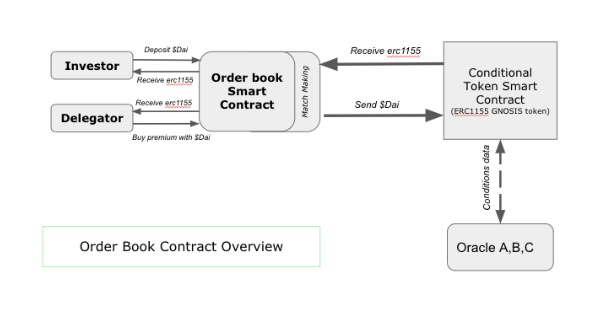
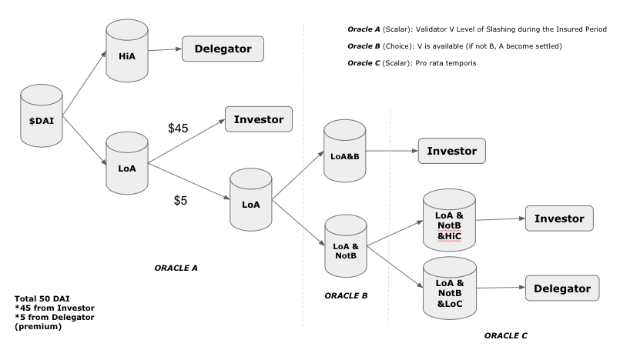
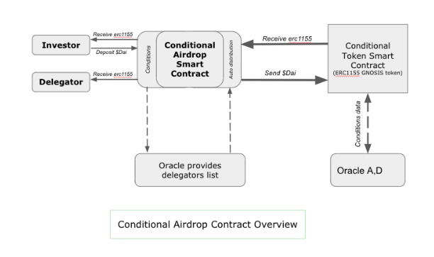
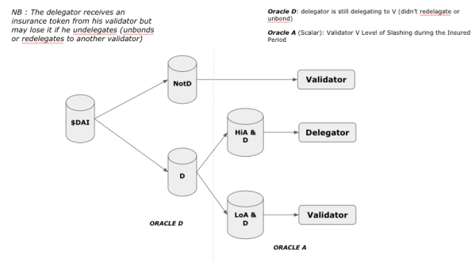
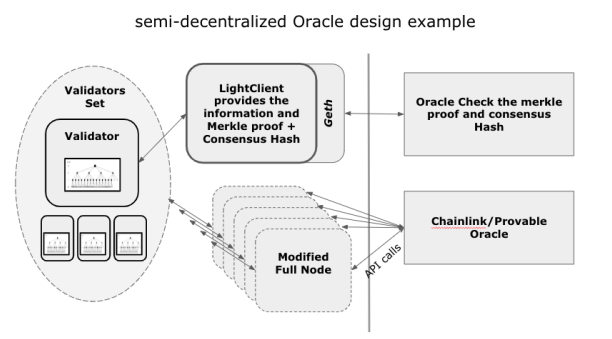
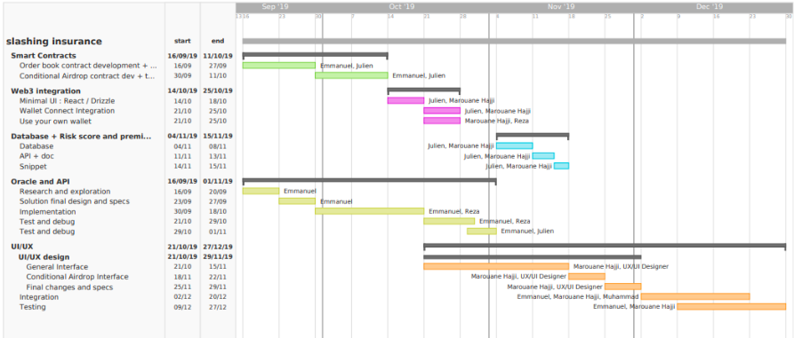

# Project Overview

## Project name
PꝏlStake Slashing Insurance

## Team members 
[Marouane Hajji](https://www.linkedin.com/in/marouane-h-b876133/)   
[Emmanuel Lаnɡе](https://www.linkedin.com/in/emmanuellange/)   
[Julien Klераtϲһ](https://www.linkedin.com/in/julienklepatch)   
Reza Bakhshandeh   
Muhammad Mafazine   
Jean-Baptiste Soufron   

## What project are you building 
PꝏlStake is a self-funded experiment consisting on creating series of Ethereum Smart Contracts and building tools related to pooling and staking. The idea is to provide pieces of software that allow people to leverage their number and regroup (pooling) in different kinds of settings and in a decentralized manner. Staking pools and staking derivatives became our main focus after numerous discussions with the different PoS blockchain projects in the space and their communities.

One of the tools that we are currently building is an insurance-like product for slashing events.
In order to implement it, we will use prediction markets and build it on top of the Conditional Token Standard (Gnosis Mercury) and connect it to the Cosmos Hub as our first PoS Blockchain to insure. This will enable our users to have access to a new type of product through an insurance like market-place while bringing a solution to the current pain point being the slashing risk in the staking process of PoS blockchains.

## Why did you decide to build it 
PoolStake is a self-funded experiment consisting on creating series of Ethereum Smart Contracts and building tools related to pooling and staking. The idea is to provide pieces of software that allow people to leverage their number and regroup (pooling) in different kinds of settings and in a decentralized manner. Staking pools and staking derivatives became our main focus after numerous discussions with the different PoS blockchain projects in the space and their communities.

One of the tools that we are currently building is an insurance-like product for slashing events.
In order to implement it, we will use prediction markets and build it on top of the Conditional Token Standard (Gnosis Mercury) and connect it to the Cosmos Hub as our first PoS Blockchain to insure. This will enable our users to have access to a new type of product through an insurance like market-place while bringing a solution to the current pain point being the slashing risk in the staking process of PoS blockchains.

## How long will it take 
4 months with grants from both ICF (InterChain Foundation) and GECO, 6 months with a grant from GECO alone.

## How much funding are you requesting  
+ Approx. 60K€ 
+ a one million Dai credit line over one year (to kick off the project)
+ PR / Marketing assistance

## How did you hear about the GECO
Website, Telegram, Dappcon

# Your Proposal

## Project description

To help understand what we are building and what staking derivatives are, here are some definitions that are based on the Tendermint (Cosmos) PoS consensus and could be applied to most PoS blockchains:

_Proof of Stake (PoS):_ consensus mechanism that runs virtually instead of relying on miners to solve hard cryptographic puzzles using their computer power.

_Validator:_ In PoS validators replace miners. Validators offer coin holders of a PoS blockchain the possibility to use their infrastructure to lock some coins as a stake. Validators then participate in the consensus process and get rewarded when blocks are added. The Staking Rewards are distributed to the coin holders and the validators are paid a percentage fee on those rewards. Validators are businesses who secure the network.This requires specific equipment and setups (Hardware security module,  computers in secured facilities etc...)

_Slashing:_ The punishment that occurs in case of a misbehaviour from one or several validators. Misbehaviours can range from being offline and missing blocks to double signing and trying to conduct an attack on the network. The slashing punishment ranges from 0.01% to 5% of the staked Atoms (with misbehaving validator) in the case of Cosmos Hub. The punishment can vary from one blockchain to another.

_Delegator:_ Coin owner / holder who stake it. When coin holders are not able to run a validator, they can delegate it to a validator of their choice. This allows them to receive the staking reward while bearing the same slashing risk (for Cosmos Hub). Delegators pay validators for their services a commission fee (percentage of their reward).

_Staking derivatives:_ coins, tokens or tools based on the staking activity. For example a slashing insurance token is a staking derivative.

### The problems and pain points we tackle:

>1) Staking is risky, let’s make it risk-free

As explained in the previous section, the slashing risk does exist even though it can be perceived as having a very low probability of happening, as a matter of fact it happened and can still happen, again.

**=> We want to make the staking activity as risk-free as possible for delegators.**
 
>2) The staking activity is perceived as a commodity, it is not

Different types of validators exist and so far the only way to differentiate between a validator and another are the fees they apply. Some validators try to be as transparent as possible regarding their setups to show they are serious and committed to providing the most secure experience for their delegators, however the transparency marketing efforts don’t seem to be enough and do not represent any actual guarantee.
The fact that some validators offer a 0% fee is a continuous hot topic within the Cosmos Hub community. The moment when one of the 0% validators became the biggest validator in the network for a short time crystallized a mix of frustrations and worries. Followed a debate over the long term implications with regard to the individual validators’ infrastructure security and the network’s level of decentralization / concentration of voting power and influence in the hands of a few.
The slashing insurance allows to create a second level of differentiation that will be based on the Risk Score of each validator and the transactions that price it. For example, validators with 0% fees are likely to be perceived as not investing in their infrastructure and committing necessary human resources to make sure their operations run as smoothly and securely as possible. An investor who is interested in buying the risk of this validator would price it higher than the risk of another validator who’s team is specialized in setting “military grade” type of infrastructure and who is making all the necessary investments to get regularly audited, have back-up set-ups etc …

**=> Our aim is to provide the delegator community with a new indicator (Risk Score) that will allow them to choose more wisely and take into account the risks related to choosing one validator over another.**

In the spirit of differentiation, validators could also use the insurance product as a means to attract more delegations. One way of doing it can be to offer free insurance as part of their validation activity (for new delegations over a limited period of time for example). In this case validators could be buying their own risk or buying the premium from an investor and distributing the insurance token to delegators who meet certain criterias. The same reasoning could be applied to attract ICF/AiB delegations (InterChain Foundation and All in Bits represent around 20% of Atoms in circulation and are therefore the biggest delegators in existence).

**=> We want validators to use the insurance as an additional service proposal that could help them increase their fees and differentiate in an already crowded market.**

>3) Liquidity of Delegation Vouchers or Bonded Atoms:

Right now the delegation process implies a lock-up period of 21 days after unbonding before a delegator could move his Atoms. Unbonded Atoms can still be slashed during the 21 days lock-up period. Since the launch of Cosmos Hub, a need has been expressed by the community to have an alternative that provides more liquidity to delegators, either by using Delegation Vouchers (whenever someone stakes Atoms with a validator, he would receive a voucher representing staked Atoms + staking rewards to be retrieved from said validator) or bAtoms which is a similar solution. Both options create illiquid assets, each asset being linked to one particular validator and his slashing risk. Combining the resulting asset with an insurance would allow to neutralize the slashing risk and create a slashing-risk-free asset which will be more liquid.

**=> We want the insurance to help make representations of staked (bonded) Atoms more liquid by neutralizing the slashing risk.**

### The market we are addressing:

Most PoS blockchains with slashing have or will have similar pain points to what we described above. Our objective is to be able to offer the insurance to as many blockchains and projects as possible. Our primary focus for the launch is Cosmos Hub then Tendermint based PoS networks (Terra, Kava, Sentinel, IOV, IrisNet, etc …). After that we will expand the functionalities to cover Tezos (with a slightly different approach), Polkadot (once launched), Ethereum (once Casper is launched) and possibly other PoS projects that have a slashing mechanism.

Currently we have the support of 13 teams of the Cosmos ecosystem (validators, wallet providers, block explorers) and we expect to have more support by the time we launch. (see appendix) 

### Why fund us:

1) We are familiar with the ecosystem / market, conducted our research and discussed with the different stakeholders. This allowed us to identify real problems for the Cosmos Network and PoS blockchains. We are building a product that is going to be used.
2) We are building on top of the Gnosis Mercury / Conditional Tokens
3) We are a team of experienced tech entrepreneurs with a passion for blockchain
4) Our use case could be a great example of how conditional tokens can be used to tokenize insurance through prediction markets, and a DeFi success story
5) The 1155 tokens that will be created could be traded on one of the DEXes Gnosis is developing

## Features

In our current design, we plan to implement the slashing insurance around two main Smart Contracts and sets of Oracles that will be based on a modified version of Cosmos SDK. The design takes into account the existence of three types of users : Delegators - Validators - Investors

**Delegators** can : 
- Buy the premium to be insured then receive the 1155 Token
- Directly receive the insurance and the token via airdrop from a validator who offers a free insurance as part of his service

**Validators** can : 
- Buy their own risks and consider it an additional source of revenue 
- Buy the risk and the premium and airdrop the premium tokens to delegators
- Buy the premium from an Investor and airdrop them to delegators 

**Investors** can :
- Buy validators slashing risks
- Speculate on price variations of premiums (given that the insurance tokens become tradable)

### Smart Contracts features:

#### The order book contract:
 This contract will act as an order book, allowing Dai to be deposited and bid orders to be posted as well as premiums to be “market-bought” on the one hand. And 1155 tokens to be received and redeemed on the other hand.

_Comments:_
In case the validator is slashed the delegator will receive a percentage of the value at risk (here 50DAI), this could be up to 100%.
In case the validator stops validating the delegator will be reimbursed a prorata temporis part of what they have paid (here 5 DAI).

##### The conditional airdrop contract:
 will distribute the 1155 tokens to ethereum wallets based on a set of conditions and will cancel the 1155 contract given certain conditions as well.

_Comments:_
The delegator receives a free insurance through a token as long as he is still delegating. If he stops delegating, he loses the coverage.

##### Oracle features:

The Oracle will be based on a modified version of Cosmos SDK that will allow to extract all the needed data to be transmitted to the Gnosis Mercury smart contract in order to check which conditions are met. The objective is to build what we can call an “Interchain Oracle”.

The required data (slashing and historical delegations / redelegations data) can not currently be queried through RPC or via any API which led us to explore different paths to extract it. We came up with 8 different approaches ranging from a fully centralized one to almost trustless and decentralized ones. The approaches can be effectively implemented but further research is still needed to choose the best option and maybe explore some other paths. The options include the possible leverage and integration of Chainlink, Provable or Realtio to incentive data providers.

Here is an example of what an oracle design could look like:

#### User Interface features:

The interface is made of 2 different blocks based on the two smart contracts: General interface and the Conditional Airdrop Interface

_General Interface features:_

Different screens will be showing:
- The list of all validators with the possibility to search for one and rank them by Risk Score / Transaction Volume over a period of time
- The order book of each validator
- The transaction history of each validator
- Graphs: variation of premium prices / risk score / volume over time (similar to trading interfaces)

**Investors** will be able to: deposit funds, place and cancel bids, retrieve unused funds, receive 1155 tokens, send 1155 tokens back to the smart contract, retrieve Dai
Investors will also have a dashboard showing their current, past positions and P&L.

**Delegators** will be able to: buy a premium, retrieve 1155 tokens, retrieve Dai
Delegators will have a dashboard showing their current and past transactions, this will be mainly a buying history including all the premiums they bought.

_Conditional Airdrop Interface features:_

We will have a conditional airdrop interface for both validators and delegators.

**Validators** will make a transaction to create 1155 tokens after defining the different conditions of the airdrop, then they will be able to:
- Have access to up-to-date data regarding cosmos wallets matching said conditions and afferent ethereum wallets
- Distribute 1155 tokens to chosen on the interface or manually entered ethereum wallets
- Allow delegators to claim their tokens

**Delegators** will be able to sign using their ethereum wallets and see if they match the conditions for one or many validators they made delegations to then the quantity of tokens they could claim for each validator. And of course they will be able to make the transaction to claim due tokens.

#### API, DB and snippet features:

The API will allow others (validators, block explorers, investors) to have a feed containing all the data we show to the users to exploit it (show it to delegators, analyze it, etc …).
The API will have a documentation and will be done in markdown in a github repo.

The API will rely on data coming from a DB that will index the different smart contracts’ events through a separate process that listens to the blockchain events with web3 (websocket).
The resulting data will be mainly historical data of bids and transactions + transactions details for each validator. The transactions data will be used for the Risk Score calculations of each validator.

The data in the database will be used on the front-end (as described above)

The code snippet will be generated for a validator to allow them to show their risk score and a call to action to purchase a premium (the same way Yotpo or Trustpilot is used on e-commerce websites) directly on their websites by adding 3 lines of script.

## Team description
### Marouane Hajji: Product / Business Lead

Marouane first experience with code started when he was 13 years old. Later, his interest in the business world led him to get a degree from ESSEC Business School where he first studied Finance then Entrepreneurship.

He became an entrepreneur after an experience in Strategy Consulting and Finance. His time at CDO Invest in 2007 (a 4 Billions euros fund managed by AXA-IM) and the fall of Lehman Brothers while he was at Citigroup allowed him to have a hands on experience within a system that was completely broken.
As an entrepreneur he took part in the launch of WeTrillions (formerly Looly’s and Lecupboard). The impact-driven food start-up was later backed by 500 startups.

As a former smoker, he created and launched a connected vaping device to help smokers quit and get rid of their nicotine addiction, the venture later became the leading european monthly subscription box for vapers (LіquіdΒοх).

Starting from 2016 he started exploring Ethereum and pretty quickly the technology and the subsequent possibilities became an obsession for him. This led him to create and self fund PꝏlStake, a 4 people team experimenting using smart contracts to provide different sets of tools for the crypto community. After Emmanuel joined him they started focusing on staking derivatives.

### Emmanuel Lаnɡе: Tech Lead

Emmanuel has 15 years experience as a software developer. During his years in engineering school he had a deep interest in cryptographic technology and what is now called post-quantum communication was the subject of his final year thesis. He started his career as a developer and coded the first MPEG-4 HD encoder in the world (still in use today after more than 9 years). Then he co-founded BrightLoop, the company designed and manufactured software driven  power supplies for large companies and implemented industry leading software development processes. He partially sold his shares in the company and joined SoftBank Robotics as a Project Manager then SES-Imagotag (world leader in IoT deployments) as VP of Strategic program.

Being a passionate entrepreneur he became a Station F Selection Board Committee Member and co-founded Quizflip, an EdTech developing the world’s first electronic flashcard. The lack of product/market fit led him to put the project on hold and start to explore the blockchain technology.
He spent 6 months working on Tendermint and Ethereum as a CTO of H2O, a blockchain driven startup focusing on the entertainment industry, the company got quickly acquired. As an external consultant, he was lately a part-time CTO for UNESS, a ministry of higher education backed EdTech. The entrepreneurship and blockchain passions got Emmanuel and Marouane to join forces and start exploring staking derivatives.

Emmanuel holds Masters degrees from Ecole supérieure d’électricité, Georgia Tech and an MBA from INSEAD where he is also a member of the Business Angel Selection committee.

### Julien Klераtϲһ: Lead Dev

Julien used to work as a Financial Engineer in banking, and he switched to software development 5 years ago, as a contractor. He built dozens of web applications with Node.js/Javascript. He also setup the technical infrastructure of several token sales. Finally, He created Ethereum DAPPS and smart contracts for several crypto projects.

Julien was Employee #1 at Lendingblock, where he built the prototype of a crypto exchange in Node. and he also teaches Ethereum Dapps & Blockchain (Blockchain training / coaching) on his youtube channel EatTheBlocks.

Beside a solid experience in full stack web development and blockchain technologies, Julien have also setup continuous integration environments, ranging from simple setups with git hooks and bash scripts to more complex deployment scenarios with Jenkins, Ansible and Terraform.

Julien holds an MSc Engineering Degree from Ecole des Mines d’Albi and a MSc in Finance Degree from HEC.

### Reza Bakhshandeh: Back-end and smart contracts

Software Engineering bachelor and AI master degree. Reza worked previously at Boosto.io and since june 2018 on PꝏlStake, he has 14 years experience in software development and spent the last 36 months designing Tokens and Solidity Smart Contracts. He will be working part-time on the slashing insurance product under Emmanuel’s supervision.

### Muhammad Mafazine: CSS, JS and HTML wizard

Muhammad worked with Marouane on both LіquіdΒοх and PꝏlStake, he will be working part-time on the integration part of the front-end under Marouane’s supervision.

### Jean-Baptiste Soufron: Legal Advisor

Lawyer and writer, he is known for his high expertise in the digital realm. His mastership and passion led him to be the Chief Legal Officer of the Wikimedia Foundation and director of the think tank Cap Digital. He was also General Secretary of the Conseil National du Numérique after being an advisor to french President François Holland.

(https://en.wikipedia.org/wiki/Jean-Baptiste_Soufron)
(https://www.fwpa-avocats.com/jean-baptiste-soufron)

UI/UX : 
Depending on when the project starts, we will be working with either :
[Julie Brasset](https://www.linkedin.com/in/julie-brasset-27211a71/)

Or :

[Julien Coudert](https://www.linkedin.com/in/julien-coudert/)

## Timeline, Milestones and Deliverables
### High Level GANTT (GECO + ICF Grants)**

**GECO grant only case:**

The total cost estimate for the project is 105 500€. Out of which 46 000€ are part of the ICF grant and 59 500€ are part of the GECO grant.
In case we don’t have the ICF grant, we will still be able to deliver the core implementation by removing some features: 
- We won’t implement the conditional airdrop smart contract (-6250€) and its UI integration (-5500€).
- We won’t implement the API and the snippet (-3000€).
- We won’t implement Wallet Connect and use your own wallet (-6000€)
- For the Oracle, we will go for a simple centralized solution that will cost 8000€ to implement instead of 32 000€ (-24 000€)
- The audit will cost 4000€ instead of 10000€ (-6000€)

These changes will bring the cost estimate to 54 750€.

## Milestones and deliverables:

### Phase 1: Smart Contracts

**Deliverables:**
The order book contract and conditional airdrop contract. The two contracts being fully tested and functional.

**Time and price estimate:** 1.2 FTE for 4 weeks to develop and test, 12500€

### Phase 2: Minimal UI and Web3 Integration

**Deliverables:** 
Web3 integration will cover both Metamask and Wallet Connect / Gnosis Safe Chrome extension.
A minimal UI using Drizzle / React to support Metamask and allow users to interact with the smart contracts.

Safe will be supported separately using https://github.com/gnosis/safe-web3-provider
Use your preferred wallet option (web3 provider is not detected): transaction details (smart contract address, Gas/Gwei and Data to be included) will be shown and the user will be free to use another wallet (as already currently implemented on PoolStake).

**Time and price estimate:** 1.2 FTE for 3 weeks, 9000€

### Phase 3: DB + R.S. / premiums API + documentation + code snippet

**Deliverables:** 
Separate script saving all the data in a DB and an API allowing external actors to query data. The API will be documented.
Code snippet that can be added on validator websites to show their risk score and data related to their premiums

**Time and price estimate:** 1.2 FTE for 2 weeks, 6000€

### Phase 4: User Interface Design

**Deliverables:**
Storyboards, wireframes of the UI to get to a final flow and layout.
3 overall look and feel proposals out of which one will be selected.
The final deliverable will be detailed UI specifications including all the designs, images, icons, etc …

**Time and price estimate:** UX/UI Freelance / Design Agency + ⅓ FTE for 6 weeks, 14500€

### Phase 5: User Interface Integration

**Deliverables:** The detailed UI specs and the design elements that will be provided will be implemented while using data coming from the database and from web3.

**Time and price estimate:** 1.5 FTE for 3 weeks + 1 FTE for 3 weeks testing, 11000€ + 6500€

### Phase 6: Oracles and APIs

**Deliverables:**
Fully functional and decentralized solution allowing to get the needed data and transmit it to Gnosis Mercury contracts.

**Time and price estimate:** 1.8 FTE for 6 weeks, 32000€ (to be funded by ICF)

### Phase 7: Security audits

**Deliverables:** Audit of the different smart contracts and the oracle.

**Time and price estimate:** external audit firm, 10000€ (to be funded by ICF)

### Phase 8: Content and educational material

**Deliverables:** FAQ, screencasts/ How-to videos for delegators, validators and investors.

**Time and price estimate:** on going, 4000€ (to be funded by ICF)

### Others
Nothing to report
